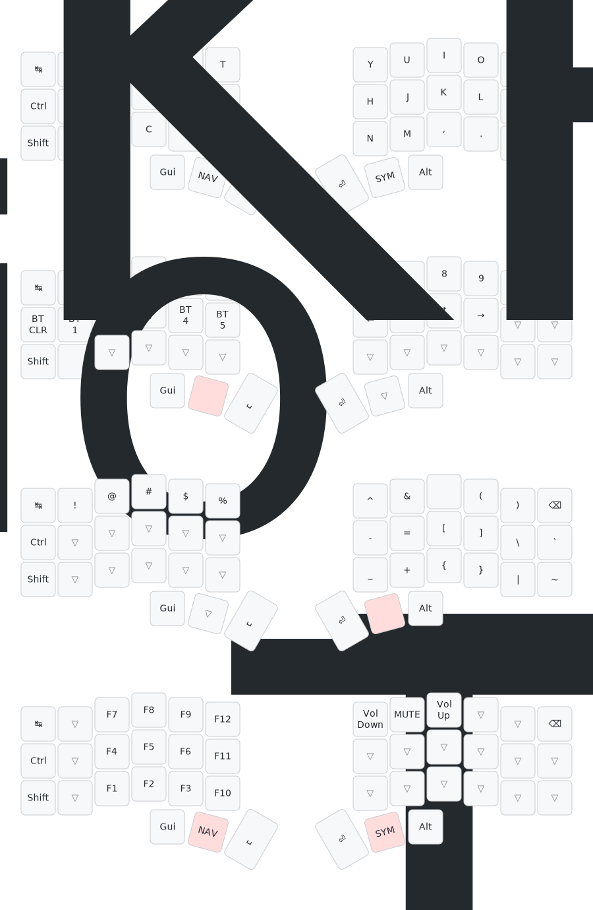

# zmk-config
<table>
  <tr>
    <td>ZMK</td>
    <td>https://zmk.dev/docs/user-setup</td>
  </tr>
  <tr>
    <td>Web editor</td>
    <td>https://nickcoutsos.github.io/keymap-editor/</td>
  </tr>
  <tr>
    <td>Keymap drawer</td>
    <td>https://github.com/caksoylar/keymap-drawer   https://keymap-drawer.streamlit.app/</td>
  </tr>
</table>

## Toucan

